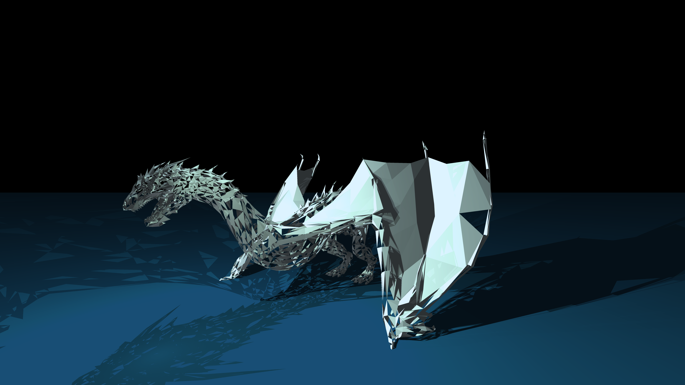

# miniRT

This 42's curriculum project implements a basic ray tracer in C.
Completely from scratch, the only library (functions) allowed where:
- minilibX, a very basic window manager
- open, close, read, write, printf, malloc, free, exit
- sin(), cos(), sqrt() and all other math library functions

It can run as an application or export to a bmp file called `scene.bmp`
It renders on the CPU, featuring antialiasing and multithreaded rendering
It supports the primitives:
- spheres
- planes
- cylinders
- squares
- triangles

## Usage
Supports both macOS and Linux
```
make bonus
./miniRT ./rt/room.rt
./miniRT --save ./rt/room.rt
```

## Renders
See `doc/renders` for more



## Benchmarking how-to
This ray tracer can be used as a fun benchmarker.
1. Change number of cores in `settings.h`
2. Run `make bonus`
3. Run `time ./miniRT rt/dragon.rt --save`

## Benchmarking results
```
MM:SS | <name> | <date>
01:01 | MacBook Pro 13-inch 2020, M1, Kernel Version 21.6.0 | 2022-11-22
00:34 | MacBook Pro 16-inch 2021, M1 Pro, Kernel Version 21.6.0 | 2022-11-22 
```